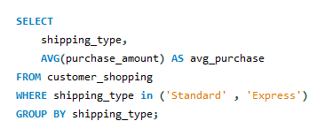
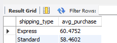
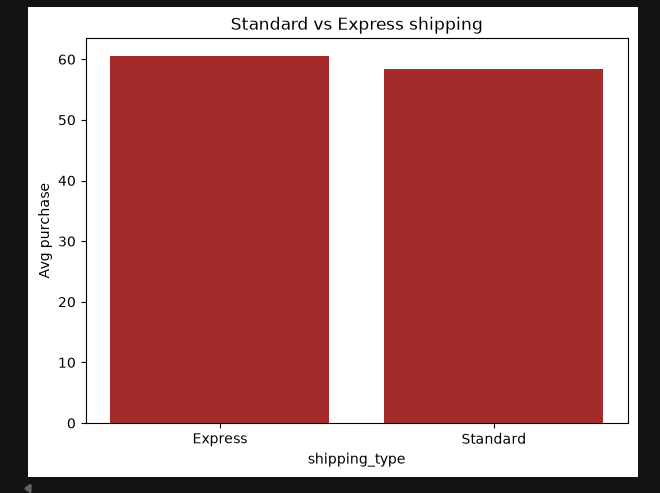

# 🛍️ Customer Shopping Behavior Analysis

A complete **Data Analyst Portfolio Project** focused on analyzing customer shopping behavior using **Python, MySQL, SQL, Pandas, NumPy, and Matplotlib**.

This project follows an end-to-end data analytics workflow, starting from raw data cleaning and exploratory analysis to SQL-based business analysis and insight generation.

## 📌 Project Overview

The main objective of this project is to analyze customer shopping data and understand important business patterns such as product performance, customer preferences, purchase behavior, and revenue trends.

This project demonstrates how a data analyst works with raw data, prepares it for analysis, stores it in a database, writes SQL queries, and converts the results into meaningful business insights.

## 🎯 Project Objectives

The project focuses on:

- Cleaning and preparing raw customer shopping data
- Performing Exploratory Data Analysis using Python
- Creating basic visualizations with Matplotlib
- Loading cleaned data into a MySQL database
- Writing SQL queries to answer business questions
- Identifying customer behavior and purchase trends
- Presenting insights in simple business language

## 🛠️ Tools & Technologies Used

| Category              | Tools                      |
| ---------------------- | -------------------------- |
| Programming Language  | Python                     |
| Libraries              | Pandas, NumPy, Matplotlib  |
| Database               | MySQL                      |
| Query Language         | SQL                        |
| IDE / Editor           | VS Code, Jupyter Notebook  |

## 📂 Project Structure

```
Customer-Shopping-Behavior-Analysis/
│
├── data/
│   └── raw_customer_data.csv
│
├── notebooks/
│   └── customer_shopping_analysis.ipynb
│
├── sql/
│   └── customer_behavior_queries.sql
│
├── screenshots/
│   ├── sql_query_shipping_type.png
│   ├── sql_result_shipping_type.png
│   └── chart_standard_vs_express_shipping.png
│
├── requirements.txt
└── README.md
```

*Note: Folder and file names can be updated based on the actual project structure.*

## 📊 Dataset Information

| Detail          | Information                                  |
| ---------------- | --------------------------------------------- |
| Dataset Name     | Customer Shopping Trends Dataset              |
| Dataset Source   | Kaggle                                        |
| Records          | 3,900 rows                                    |
| Columns          | 18 columns                                    |
| Dataset Type     | Retail / Customer Shopping Behavior Dataset   |

This dataset contains customer shopping behavior information such as customer demographics, purchased items, product categories, purchase amount, location, season, review rating, subscription status, discount usage, promo code usage, previous purchases, payment method, and frequency of purchases.

### Example Columns

- Customer ID
- Age
- Gender
- Item Purchased
- Category
- Purchase Amount
- Location
- Size
- Color
- Season
- Review Rating
- Subscription Status
- Payment Method
- Shipping Type
- Discount Applied
- Promo Code Used
- Previous Purchases
- Preferred Payment Method
- Frequency of Purchases

## 🧹 Data Cleaning & EDA

Data cleaning and Exploratory Data Analysis were performed using **Python** in Jupyter Notebook.

### Steps Performed

- Imported the raw dataset
- Checked dataset shape and column details
- Checked missing values
- Checked duplicate records
- Verified data types
- Renamed columns for better readability
- Explored numerical and categorical columns
- Analyzed customer behavior patterns
- Created basic visualizations using Matplotlib
- Prepared the cleaned dataset for SQL analysis

## 🗄️ Database Storage

After cleaning the dataset, the final data was loaded into a **MySQL database**.

This step helped simulate a real business environment where analysts work with structured databases and use SQL to extract insights.

**Database Name:** `customer_behaviour`
**Table Name:** `customer_shopping`

## 💻 SQL Business Analysis

SQL was used to answer business-related questions and extract useful insights from the customer shopping data.

### SQL Concepts Used

- SELECT
- WHERE
- GROUP BY
- ORDER BY
- Aggregate functions
- Subqueries
- CASE statements
- Common Table Expressions
- Window functions
- Ranking
- Filtering and sorting
- Business-based analysis

## 🔍 Business Questions Answered

This project answers the following business questions using SQL:

1. What is the total revenue generated by male versus female customers?
2. Which customers used a discount but still spent more than the average purchase amount?
3. Which are the top 5 products with the highest average review rating?
4. What is the average purchase amount for Standard and Express shipping?
5. Do subscribed customers spend more than non-subscribed customers?
6. Which five products have the highest percentage of purchases with discounts applied?
7. How can customers be segmented into New, Returning, and Loyal customers based on previous purchases?
8. What are the top 3 most purchased products within each category?
9. Are repeat buyers more likely to subscribe?
10. What is the revenue generated by each age group?

## 📈 Key Insights

- **Male customers generated higher total revenue** compared to female customers. Male customers contributed **$157,890**, while female customers contributed **$75,191** in total purchase amount.
- **839 customers used a discount and still spent more than the average purchase amount.** The average purchase amount was approximately **$59.76**, and these customers spent **$60 or more** even after using discounts.
- The top 5 products with the highest average review ratings were **Gloves**, **Sandals**, **Boots**, **Hat**, and **Skirt**. Among them, **Gloves** had the highest average review rating of **3.86**.
- **Express shipping had a slightly higher average purchase amount** compared to Standard shipping — **$60.48** vs **$58.46**.
- **Non-subscribed customers generated higher total revenue** than subscribed customers — **$170,436** vs **$62,645**. However, the average purchase amount was almost the same for both groups.
- The products with the highest discount usage percentage were **Hat**, **Sneakers**, **Coat**, **Sweater**, and **Pants**. **Hat** had the highest discount rate at **50.00%**.
- Most customers were classified as **Loyal customers** based on previous purchases — **3,116 Loyal**, **701 Returning**, and **83 New** customers.
- In category-wise product performance, top products included **Jewelry, Belt, and Sunglasses** in Accessories; **Blouse, Pants, and Shirt** in Clothing; **Sandals, Shoes, and Sneakers** in Footwear; and **Jacket and Coat** in Outerwear.
- Among repeat buyers with more than 5 previous purchases, **2,518 customers were not subscribed**, while **958 customers were subscribed** — showing many repeat buyers are still not converted into subscribers.
- The **46-55 age group generated the highest revenue**, with a total purchase amount of **$45,619**.

## 📊 Visualizations

Matplotlib was used to create simple and clear visualizations for understanding shopping trends.

### Charts Created

- Sales by product category
- Purchase amount distribution
- Customer age distribution
- Payment method analysis
- Season-wise purchase trends
- Gender-wise purchase behavior
- Standard vs Express shipping — average purchase comparison

## 📸 Screenshots

**SQL Query — Average purchase amount by shipping type**

```sql
SELECT
    shipping_type,
    AVG(purchase_amount) AS avg_purchase
FROM customer_shopping
WHERE shipping_type IN ('Standard', 'Express')
GROUP BY shipping_type;
```



**Query Result**



**Matplotlib Chart — Standard vs Express Shipping**



## ⚙️ How to Run This Project

### 1. Clone the Repository

```bash
git clone https://github.com/silentharxx/Customer-Shopping-Behavior-Analysis.git
cd Customer-Shopping-Behavior-Analysis
```

### 2. Install Required Libraries

```bash
pip install -r requirements.txt
```

### 3. Run the Jupyter Notebook

Open the notebook:

```
notebooks/customer_shopping_analysis.ipynb
```

This notebook contains:

- Data importing
- Data exploration
- Data cleaning
- Exploratory Data Analysis
- Basic visualizations
- Cleaned data preparation

### 4. Load Data into MySQL

Create a MySQL database and load the cleaned dataset into a table.

Example table name: `customer_shopping`

### 5. Run SQL Queries

Open and run the SQL file:

```
sql/customer_behavior_queries.sql
```

This file contains all business analysis queries used in the project.

## 📚 Learning Outcomes

Through this project, I learned how to:

- Work with raw customer shopping data
- Clean and prepare data using Pandas and NumPy
- Perform Exploratory Data Analysis
- Create visualizations using Matplotlib
- Store cleaned data in MySQL
- Write SQL queries for business analysis
- Use CTEs and window functions in SQL
- Convert raw data into meaningful business insights
- Structure a data analytics project for GitHub portfolio

## 🚀 Future Improvements

This project can be improved further by:

- Adding a Power BI dashboard
- Creating more advanced visualizations
- Adding more business questions
- Creating a final project report
- Adding a presentation deck
- Automating the data cleaning process
- Comparing customer behavior across different segments

## 🙏 Credits

This project was created as part of my data analytics learning journey.

I followed a YouTube tutorial as a learning reference and then practiced data cleaning, SQL queries, and analysis independently.

**Tutorial Reference:** [Customer Behavior Data Analyst Portfolio Project](https://www.youtube.com/watch?v=5PrZvPeUw60&list=PLAx-M6Di0SisFJ1rv5M_FRHUlGA5rtUf_&index=3)

## 👤 About Me

**Harshit Mishra**  
BCA Data Science Student | Aspiring Data Analyst

I am currently learning data analytics and building portfolio projects using Python, SQL, MySQL, Pandas, NumPy, and Matplotlib.

- GitHub: [github.com/silentharxx](https://github.com/silentharxx)
- LinkedIn: [linkedin.com/in/harshit-mishra-570267377](https://www.linkedin.com/in/harshit-mishra-570267377)

## 📜 License

This project is licensed under the MIT License.

You are free to use this project as a reference for learning purposes.
